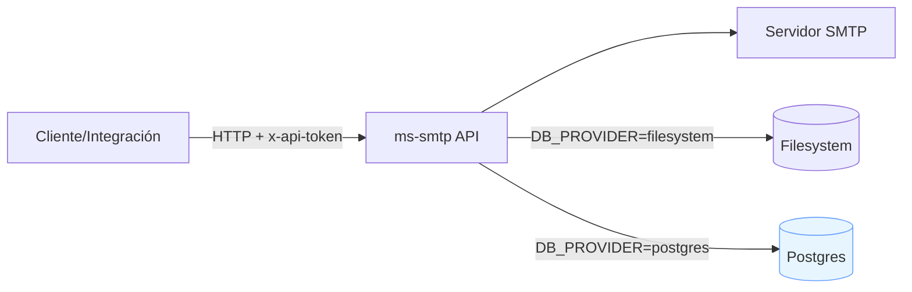
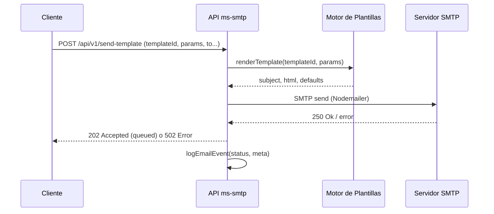

# Microservicio SMTP (Node + Express)


Microservicio para enviar correos vía API usando SMTP. Incluye autenticación por token (header `x-api-token`) y documentación interactiva con Swagger en `/docs`.

## Visión general (Arquitectura)



### Secuencia de envío (por plantilla)


## Requisitos
- Node.js 18+
- Servidor SMTP accesible (host, puerto, credenciales si aplica)

## Instalación
1. Copia `.env.example` a `.env` y completa los valores:
   ```bash
   cp .env.example .env
   ```
2. Instala dependencias:
   ```bash
   npm install
   ```

## Variables de entorno principales
- `PORT`: Puerto del servidor Express (default 3000)
- `API_TOKEN`: Token para consumir la API (requerido)
- `SMTP_HOST`: Host SMTP (requerido)
- `SMTP_PORT`: Puerto SMTP (587 típico, 465 para TLS implícito)
- `SMTP_SECURE`: `true` si usas 465 (TLS implícito); `false` para STARTTLS en 587
- `SMTP_USER`, `SMTP_PASS`: Credenciales SMTP si son necesarias
- `SMTP_FROM_DEFAULT`: Remitente por defecto si no se envía `from` en el payload

Opciones avanzadas en `.env.example`.

### Tabla resumen de variables de entorno

| Variable | Requerido | Default | Descripción |
|---|:---:|---|---|
| PORT | No | 3000 | Puerto base. El servicio hará fallback al siguiente libre. |
| API_TOKEN | Sí | - | Token para autenticar requests (header x-api-token). |
| SMTP_HOST | Sí | - | Host del servidor SMTP. |
| SMTP_PORT | Sí | 587 | Puerto SMTP. 465 para TLS implícito. |
| SMTP_SECURE | No | false | true para TLS implícito (465). |
| SMTP_USER | No | - | Usuario SMTP (si aplica). |
| SMTP_PASS | No | - | Password SMTP (si aplica). |
| SMTP_FROM_DEFAULT | No | "Nombre <no-reply@example.com>" | Remitente por defecto. |
| LOG_DIR | No | ./data/logs | Directorio para logs JSONL (filesystem). |
| LOG_FILE_NAME | No | email.log | Nombre de archivo de logs. |
| TEMPLATES_DIR | No | ./data/templates | Directorio de plantillas (filesystem). |
| DB_PROVIDER | No | filesystem | Cambia a postgres para usar Postgres. |
| PG_CONNECTION_STRING | No | - | Cadena de conexión completa a Postgres. |
| PG_HOST | No | localhost | Host Postgres (si no usas connection string). |
| PG_PORT | No | 5432 | Puerto Postgres. |
| PG_USER | No | postgres | Usuario Postgres. |
| PG_PASSWORD | No | - | Password Postgres. |
| PG_DATABASE | No | ms_smtp | Base de datos. |
| PG_SSL | No | false | Si la conexión usa SSL. |
| SWAGGER_PATH | No | /docs | Ruta donde se monta Swagger UI. |

## Docker / Docker Compose

Ejemplo para levantar Postgres y el microservicio:

```yaml
version: '3.9'
services:
  db:
    image: postgres:16
    environment:
      POSTGRES_DB: ms_smtp
      POSTGRES_USER: ms
      POSTGRES_PASSWORD: ms
    ports:
      - "5432:5432"
    volumes:
      - pgdata:/var/lib/postgresql/data

  ms_smtp:
    image: node:20-alpine
    working_dir: /app
    command: sh -c "npm ci && npm run start"
    volumes:
      - ./:/app
    environment:
      PORT: 3000
      API_TOKEN: your-secure-token
      SMTP_HOST: smtp
      SMTP_PORT: 587
      SMTP_SECURE: "false"
      SMTP_USER: usuario
      SMTP_PASS: clave
      SMTP_FROM_DEFAULT: "Servicio <no-reply@example.com>"
      DB_PROVIDER: postgres
      PG_HOST: db
      PG_PORT: 5432
      PG_USER: ms
      PG_PASSWORD: ms
      PG_DATABASE: ms_smtp
      PG_SSL: "false"
    ports:
      - "3000:3000"
    depends_on:
      - db

volumes:
  pgdata:
```

## Ejecutar
- Desarrollo (con nodemon):
  ```bash
  npm run dev
  ```
- Producción:
  ```bash
  npm start
  ```
  - La app escuchará en `http://localhost:3000` (o el puerto configurado).
  - La app se iniciará en el primer puerto disponible comenzando en `PORT` (por defecto 3000). Revisa la consola para ver el puerto final.

## Documentación Swagger
- Abre `http://localhost:<PUERTO>/docs` (ver consola para el puerto en uso).
- Agrega el header de seguridad `x-api-token` con el valor de `API_TOKEN` para probar los endpoints.

## Endpoint

POST ` /api/v1/send-email `

Headers:
- `Content-Type: application/json`
- `x-api-token: <tu_token>`

Body (JSON):
```json
{
  "from": "Nombre <no-reply@example.com>",
  "to": ["destino@example.com"],
  "cc": "copia@example.com",
  "bcc": ["oculto1@example.com", "oculto2@example.com"],
  "subject": "Asunto de prueba",
  "html": "<h1>Hola</h1><p>Este es un correo de prueba</p>",
  "text": "Hola - Este es un correo de prueba",
  "replyTo": "responder-a@example.com",
  "attachments": [
    {
      "filename": "ejemplo.txt",
      "content": "SG9sYQ==",
      "encoding": "base64"
    }
  ]
}
```

Respuesta 202:
```json
{
  "status": "queued",
  "result": {
    "messageId": "<...>",
    "accepted": ["destino@example.com"],
    "rejected": [],
    "response": "250 2.0.0 Ok: queued"
  }
}
```

## Ejemplo con curl
```bash
curl -X POST http://localhost:3000/api/v1/send-email \
  -H 'Content-Type: application/json' \
  -H 'x-api-token: TU_TOKEN' \
  -d '{
    "to": "destino@example.com",
    "subject": "Hola",
    "html": "<b>Prueba</b>"
  }'
```

## Logs de envíos

- GET `/api/v1/logs` (con `x-api-token`):
  - Query params opcionales: `status`, `to`, `from`, `contains`, `start`, `end`, `limit`, `offset`.
  - Ejemplo:
    ```bash
    curl 'http://localhost:3001/api/v1/logs?status=success,failed&limit=50' \
      -H 'x-api-token: TU_TOKEN'
    ```
  - Respuesta: objeto con `total`, `offset`, `limit`, `items` (cada item es un evento con `status`, `timestamp`, `to`, `from`, `subject`, etc.)

- POST `/api/v1/logs` (con `x-api-token`):
  - Permite registrar manualmente eventos como `canceled` o `spam` cuando provienen de otro sistema/feedback.
  - Body:
    ```json
    {
      "status": "canceled",
      "to": "user@example.com",
      "subject": "Campaña X",
      "meta": { "reason": "usuario solicitó cancelación" }
    }
    ```

### Notas
- El servicio registra automáticamente `success` y `failed` en el endpoint de envío.
- Estados como `canceled` o `spam` usualmente provienen de feedback externo (proveedor, webhook, sistema anti-spam). Puedes registrarlos vía `POST /api/v1/logs`.
- Los logs se almacenan en formato JSONL en `LOG_DIR/LOG_FILE_NAME` (ver `.env.example`).

## Verificación SMTP

- GET `/api/v1/smtp-check` (con `x-api-token`): verifica conectividad/credenciales con `transporter.verify()`.
  ```bash
  curl http://localhost:3001/api/v1/smtp-check \
    -H 'x-api-token: TU_TOKEN'
  ```
  Respuesta 200:
  ```json
  { "ok": true, "verified": true, "host": "smtp.example.com", "port": 587, "secure": false }
  ```
  Si falla, devuelve 502 con `{ ok: false, error }`.

## Salud del servicio
- `GET /health` -> `{ status: 'ok', uptime: <segundos> }`

## Notas de seguridad
- Mantén `API_TOKEN` en secreto y cámbialo regularmente.
- En producción, usa `SMTP_TLS_REJECT_UNAUTH=true`.
- Configura correctamente CORS si expones el servicio a terceros.

---

## Características
- Envío de correos vía SMTP con autenticación por token (`x-api-token`).
- Documentación interactiva con Swagger en `/docs`.
- Registro de eventos de envío (success/failed/otros) y consulta con filtros.
- Sistema de plantillas con Handlebars: CRUD + envío por plantilla.
- Fallback automático de puerto: inicia en `PORT` y prueba puertos siguientes si está ocupado.
- Backend de almacenamiento opcional:
  - Filesystem (por defecto): logs en JSONL, plantillas en JSON.
  - Postgres (opcional): tablas `email_logs` y `email_templates` con migración automática.

## Plantillas (Templates)
Endpoints principales (todas requieren `x-api-token`):
- GET `/api/v1/templates` — lista plantillas.
- GET `/api/v1/templates/{id}` — obtiene una plantilla.
- POST `/api/v1/templates` — crea una plantilla. Campos mínimos: `name`, `subject`, `html`. Opcional `id`, `defaults`.
- PUT `/api/v1/templates/{id}` — actualiza.
- DELETE `/api/v1/templates/{id}` — elimina.
- POST `/api/v1/send-template` — envía correo desde una plantilla.

Ejemplos rápidos:
```bash
curl -X POST http://localhost:<PUERTO>/api/v1/templates \
  -H 'Content-Type: application/json' -H 'x-api-token: TU_TOKEN' \
  -d '{
    "id": "bienvenida",
    "name": "Email de Bienvenida",
    "subject": "Hola {{firstName}} 👋",
    "html": "<h1>Hola {{firstName}}</h1><p>Bienvenido a {{company}}</p>",
    "defaults": { "from": "Soporte <no-reply@tu-dominio.com>" }
  }'

curl -X POST http://localhost:<PUERTO>/api/v1/send-template \
  -H 'Content-Type: application/json' -H 'x-api-token: TU_TOKEN' \
  -d '{
    "templateId": "bienvenida",
    "params": { "firstName": "Ana", "company": "MiApp" },
    "to": "ana@example.com"
  }'
```

## Backend opcional Postgres (con fallback automático)
- Activa Postgres poniendo `DB_PROVIDER=postgres` en `.env`.
- Conexión por `PG_CONNECTION_STRING` o variables `PG_HOST`, `PG_PORT`, `PG_USER`, `PG_PASSWORD`, `PG_DATABASE`, `PG_SSL`.
- En el arranque, el servicio creará automáticamente:
  - `email_logs`: eventos de envío.
  - `email_templates`: plantillas.
- Si la conexión falla, se registrará en consola y se hará fallback automático a filesystem.

## Resumen de configuración
- `PORT`: puerto base (por defecto 3000). Arranque usa puerto disponible.
- `API_TOKEN`: requerido para consumir la API.
- SMTP: `SMTP_HOST`, `SMTP_PORT`, `SMTP_SECURE`, `SMTP_USER`, `SMTP_PASS`, `SMTP_FROM_DEFAULT`.
- Logs (filesystem): `LOG_DIR`, `LOG_FILE_NAME`.
- Plantillas (filesystem): `TEMPLATES_DIR`.
- Base de datos: `DB_PROVIDER=filesystem|postgres`, `PG_*`.

## Troubleshooting
- Puerto en uso: el servicio probará el siguiente automáticamente. Ver consola para el puerto final.
- Error SMTP (502): validar host/puerto, `SMTP_SECURE`, credenciales y que el servidor permita relay.
- Swagger sin autorización: incluir `x-api-token` en Authorize o en cada request.
- Postgres no disponible: revisar conexión/credenciales; el servicio caerá a filesystem y seguirá operativo.

## Licencia
Este proyecto se distribuye bajo la licencia incluida en `LICENSE`.

## Autor
Proyecto público de eCortes.cl
- Sitio: https://eCortes.cl
- Mantención y contribuciones: PRs y issues son bienvenidos.
